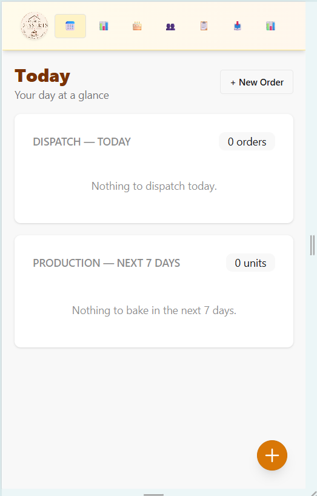
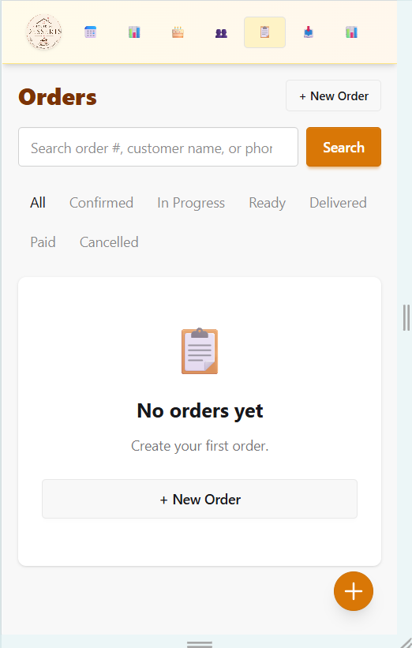

# House of Desserts

A self-hosted order management system for a small bakery.

Built for speed, offline-friendly operation, and zero infrastructure cost.
Runs on a free-tier cloud VM, reachable from any device via Tailscale.

## What it does

- **Order lifecycle** — INQUIRY → CONFIRMED → IN_PROGRESS → READY → DELIVERED → PAID (terminal), or CANCELLED (terminal). Illegal transitions rejected.
- **Edit orders** — while CONFIRMED, with audit trail, guarded so the total can't drop below what's already been paid.
- **Today page** — dispatch list (orders fulfilling today, sorted by time) plus production needs aggregated by SKU across the next 7 days.
- **Customers** — multiple addresses, one default, search by name or phone, paginated.
- **Products** — SKU auto-generated from name + weight + pack, editable, live uniqueness check, weight/volume and pack size support, soft delete.
- **Orders** — search by order number, customer name, or phone; paginate; filter by status.
- **Payments** — partial payments tracked separately from fulfillment. Two badges everywhere: fulfillment state and payment state.
- **Invoices** — immutable snapshot at issue time. Sequential numbering. PDF export (fpdf2) and thermal receipt (ESC/POS).
- **WhatsApp links** — one-tap messages to customers, configurable templates, no API keys needed.
- **Monthly reports** — PDF and CSV summaries, generated manually or automatically on the 1st of the month.
- **Exports** — CSV and JSON for tax filing.
- **Audit log** — append-only, written in the same transaction as the mutation it describes.
- **Backups** — nightly local (30-day retention) and offsite to Google Drive via rclone.

## Stack

| Layer | Technology |
|---|---|
| Backend | Python 3.12+ / FastAPI |
| Database | SQLite (WAL) / SQLAlchemy 2.0 |
| Templates | Jinja2 + HTMX + daisyUI |
| PDF | fpdf2 (Noto font for ₹) |
| Printing | python-escpos |
| Config | pydantic-settings |
| Remote access | Tailscale |
| Hosting | Oracle Cloud Free Tier (or any Linux VM) |
| Offsite backups | rclone → Google Drive |

## Screenshots

### Today — dispatch and production



### Orders — search, filter, status at a glance


## Quick start (local dev)

```powershell
git clone https://github.com/puneet-swarup/house-of-desserts.git
cd house-of-desserts

python -m venv .venv
.\.venv\Scripts\Activate.ps1

pip install -e ".[dev]"

Copy-Item .env.example .env
python -c "import secrets; print(secrets.token_urlsafe(48))"
# Paste output into SECRET_KEY in .env

python -m uvicorn app.main:app --reload --host 127.0.0.1 --port 8000
```

Open http://127.0.0.1:8000 — it redirects to `/today`.

## Configuration

All settings live in `.env`. See `.env.example` for the full list.

| Variable | Purpose |
|---|---|
| `APP_NAME`, `APP_TAGLINE` | Shown on invoices and the UI |
| `GSTIN`, `FSSAI_NUMBER` | Printed on invoices if set |
| `SECRET_KEY` | Session signing. **Required** — generate a real one |
| `DEBUG` | `true` in dev, `false` in prod |
| `BUSINESS_TIMEZONE` | "Today" boundaries, default `Asia/Kolkata` |
| `DB_URL` | SQLite path. Use absolute paths in production |
| `BIND_HOST`, `BIND_PORT` | Where uvicorn listens |
| `PRINTER_TYPE` | `file`, `usb`, or `network` |
| `BACKUP_DIR` | Where nightly SQLite backups are written |
| `REPORTS_DIR` | Where monthly PDFs and CSVs are written |
| `WHATSAPP_ENABLED` | Toggle WhatsApp buttons |
| `WHATSAPP_MESSAGES_FILE` | Path to message templates JSON |

## Data model

- **Customer** — soft delete via `is_active`, partial unique index on phone
- **Address** — multiple per customer, exactly one default
- **Product** — soft delete, weight/volume, pack size, GST rate
- **Order** — human-readable `HOD-YYYY-NNNN` number from a sequence table
- **OrderItem** — frozen unit price, GST rate, GST amount, line total (all `Numeric`)
- **Payment** — one row per transaction, explicit `received_at`
- **Invoice** — immutable snapshot: business identity, billed-to, line items as JSON, all totals as of issue time
- **NumberSequence** — monotonic counter per prefix; guarantees gapless numbering
- **AuditLog** — append-only; commits with the mutation it describes

## Development

```powershell
# Fast tests (no browser) — ~5 seconds
pytest

# Browser-based UI tests — ~50 seconds
pytest tests/ui -v

# Lint
ruff check app tests
```

### Project layout

```
app/
  config.py              Typed settings from .env
  database.py            Engine, session, PRAGMAs
  main.py                App factory, routers, Jinja filters
  middleware.py          Cache-control headers
  models/                SQLAlchemy 2.0 declarative models
  routers/               HTTP endpoints
  services/              Business logic
  utils/
    money.py             Decimal helpers
    time.py              Naive-UTC storage + business-tz display
    sku.py               SKU generation and normalization
    escpos_printer.py    Thermal printer
  templates/             Jinja2 + HTMX + daisyUI
  static/                Pre-built Tailwind, fonts, favicon

scripts/
  backup.py              Nightly backup script
  monthly_report.py      Monthly report generator (for cron)

tests/
  conftest.py            Fixtures (in-memory SQLite with FK ON)
  ui/                    Playwright tests
  ...

config/
  messages.json          WhatsApp message templates
```

## Key design decisions

- **Money is `Decimal`, never `Float`.** Columns are `Numeric(12,2)`. All arithmetic goes through `app.utils.money.money()`. Per-line rounding, half-up.
- **Invoices are immutable.** Editing an order after issuing does not change the invoice.
- **Numbering comes from a sequence table**, not a count. Concurrency-safe and gapless.
- **Audit writes commit with the mutation.** `log_action` never commits on its own.
- **Foreign keys are enforced** via `PRAGMA foreign_keys=ON` on every connection.
- **WAL + busy_timeout** so backups and writes don't deadlock.
- **Naive UTC storage, business-tz display.** See `app/utils/time.py`.
- **Fulfillment and payment are orthogonal.** Two separate badges, two separate state machines.
- **Tailscale-only access in production.** No ports open to the public internet.

## Operations

- Local: see [docs/OPERATIONS.md](docs/OPERATIONS.md)
- Deployment, recovery, and cron: held in a private companion repo (coordinates and secrets)

## License

All rights reserved. This source is published for portfolio and evaluation
purposes only. See [LICENSE](LICENSE) for terms.